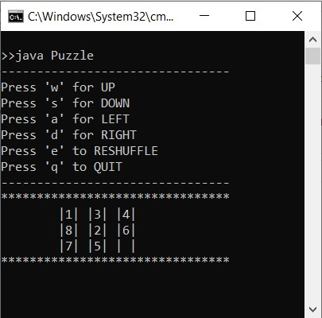
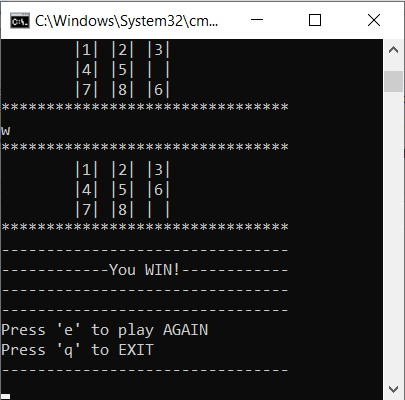
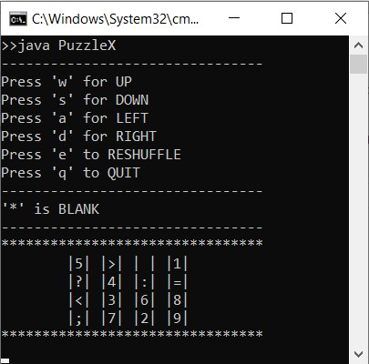

# NumberGridPuzzle
A puzzle game based on arranging cells on a grid by shifting them to adjacent spaces. This is a command line game with keyboard inputs. This is a collection of various versions of the game.
## Description

The goal of the game is to arrange all the numbers sequentially left to right in a grid. You can only move adjacent cells into a blank space. This allows you to shift the cells and place the numbers in their correct locations. 

## Variations
- **[Puzzle](Puzzle.java)** : Puzzle of 3X3 grid with numbers 1-8.

- **[Puzzle2](Puzzle2.java)** : Puzzle of 4x4 grid with numbers 1-15.

- **[PuzzleInt](PuzzleInt.java)** : Implementation of Puzzle using `integer` type to store the data.

- **[PuzzleN](PuzzleN.java)** : Genrate the game for any defined size(N X N).

- **[PuzzleX](PuzzleX.java)** : An easier version which gives an additional row and column to help arrange the digits.

- **[PuzzlePy](PuzzlePy.py)** : Implementation of the game using python.

## Controls
- Press 'w' for UP
- Press 's' for DOWN
- Press 'a' for LEFT
- Press 'd' for RIGHT
- Press 'e' to RESHUFFLE
- Press 'q' to QUIT

## Demo

https://github.com/Prady-mn/NumberGridPuzzle/assets/154269967/69f2ae53-db91-4eca-8efc-326c7a70ccb7 

https://github.com/Prady-mn/NumberGridPuzzle/assets/154269967/1d0d7432-4079-4aed-bbb2-2914958000cc

https://github.com/Prady-mn/NumberGridPuzzle/assets/154269967/018eb4d0-5be2-436d-8c4c-246aac4b8f76

 
